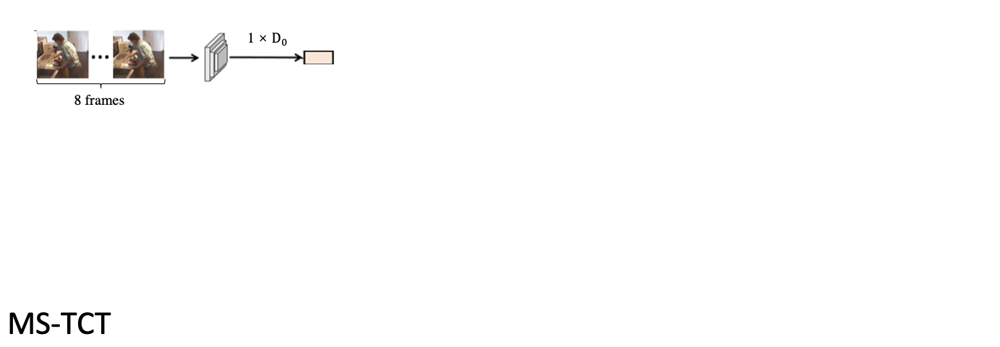

# [CVPR 2022] MS-TCT 



[[Paper Link](https://openaccess.thecvf.com/content/CVPR2022/papers/Dai_MS-TCT_Multi-Scale_Temporal_ConvTransformer_for_Action_Detection_CVPR_2022_paper.pdf)]

In this repository, we provide an implementation of "MS-TCT: Multi-Scale Temporal ConvTransformer for Action Detection" on **Charades** dataset (Localization setting, i.e., Charades_v1_localize). If you want to train and evaluate MS-TCT, you can follow the following steps. 
For **MultiTHUMOS**, you can follow the training process [here](https://github.com/dairui01/MS-TCT/issues/2). 

## Prepare the I3D feature
Like the previous works (e.g. TGM, PDAN), MS-TCT is built on top of the pre-trained I3D features. Thus, feature extraction is needed before training the network.  
1. Please download the Charades dataset (24 fps version) from this [link](https://prior.allenai.org/projects/charades).
2. Follow this [repository](https://github.com/piergiaj/pytorch-i3d) to extract the snippet-level I3D feature. 

## Dependencies 
Please satisfy the following dependencies to train MS-TCT correctly: 
- pytorch 1.9
- python 3.8 
- timm 0.4.12
- pickle5
- scikit-learn
- numpy

## Quick Start
1. Change the _rgb_root_ to the extracted feature path in the _train.py_. 
2. Use `./run_MSTCT_Charades.sh` for training on Charades-RGB. The best logits will be saved automatically in _./save_logit_. 
3. Use `python Evaluation.py -pkl_path /best_logit_path/` to evaluate the model with the per-frame mAP and the action-conditional metrics.

## Remarks
- The network implementation is in _./MSTCT/_ folder. 
- RGB and Optical flow are following the same training process. Both modalities can be added in the logit-level to have the **two-stream** performance (i.e., late fusion). Note that, we mainly focus on the **pure RGB** result in the paper. 
- In practice, we trained MS-TCT with a Tesla V100 GPU to shrink the computation time. But as MS-TCT is not large, GTX 1080 Ti can be sufficient for running the network. 
- For the evaluation metrics: the [standard frame-mAP](https://github.com/piergiaj/super-events-cvpr18/blob/master/apmeter.py) is following the Superevent and [action-conditional metrics](https://github.com/ptirupat/MLAD/blob/main/src/cooccur_metric.py) is following the MLAD.


## Reference
If you find our repo or paper useful, please cite us as
```bibtex
  @inproceedings{dai2022mstct,
    title={{MS-TCT: Multi-Scale Temporal ConvTransformer for Action Detection}},
    author={Dai, Rui and Das, Srijan and Kahatapitiya, Kumara and Ryoo, Michael and Bremond, Francois},
    booktitle={CVPR},
    year={2022}
  }
```
Contact: rui.dai@inria.fr
